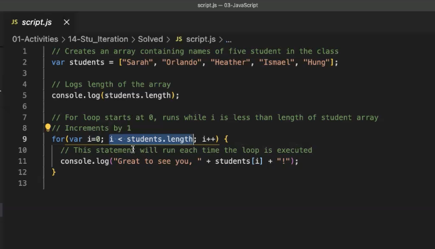
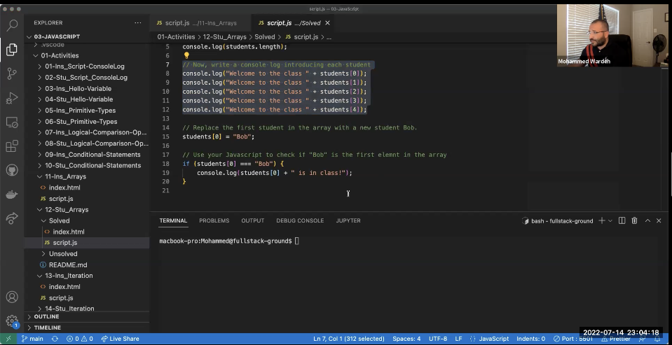
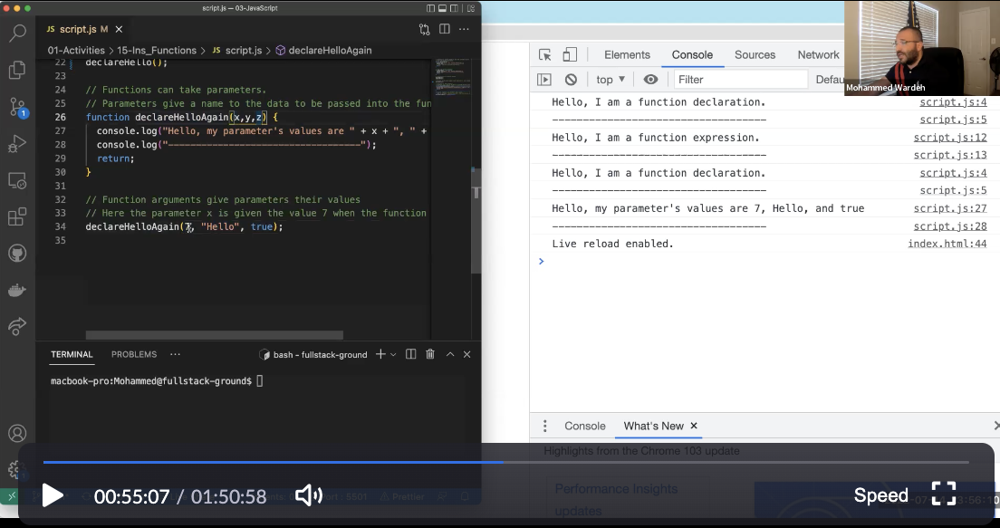
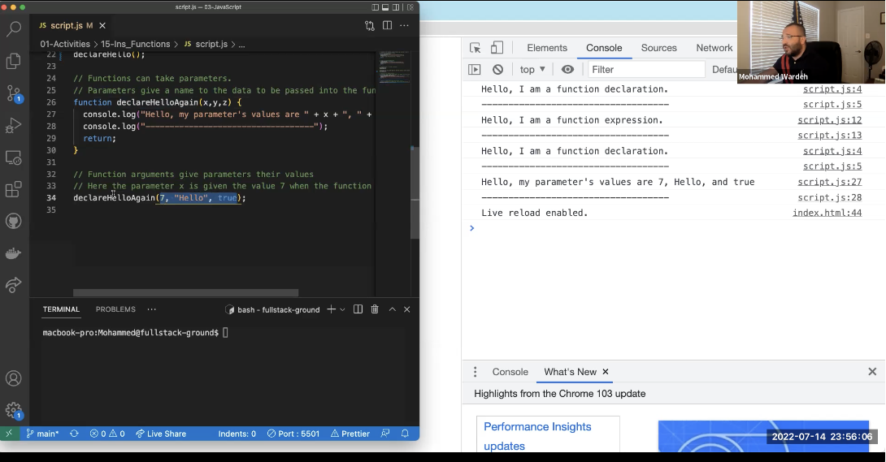
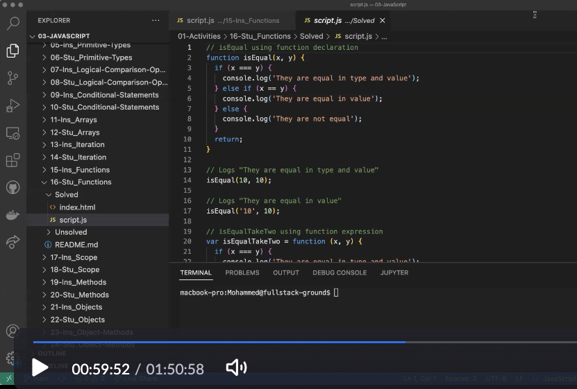
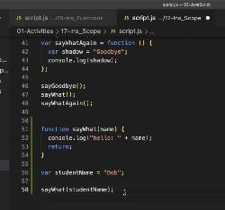
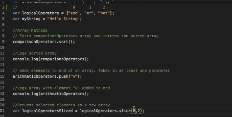
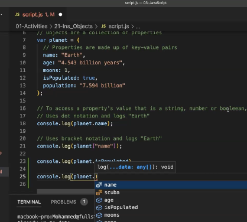
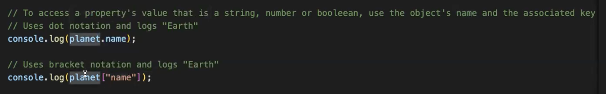

# README for Module 3
*This is a simple password generator.*

The starter code gives two functions; generatePassword() and writePassword() with an event listener, two variables (`password` and `passwordText`), and finally appends the value of the object to the DOM. 

Our role in the deveopment of this program is to capture user input so that the password has custom length and parameters. We use a for loop, Math.floor and Math.random to perform this operation. 

# Homework 3 notes 

    1.	Always start at ReadME and put it into manageable chunks
    2.	Use prompt, confirm and alert
    3.	When the user hits the button, you want them to go through this flow
    4.	Password goes in the div “card-body”
    5.	. is classes # is id
    6.	“DOM” is what’s visible in browser
    7.	Variable passwordText is linked to password in html
    8.	.value allows us to change something in the DOM
    9.	We’re saying the value of the variable will become the div password in the DOM
    10.	var generateBtn is bonded to #generate in the DOM
    11.	On line 14 we’re saying addEventListener to generateBtn on click
    12.	When that click happens, we’re going to run that writePassword() function
    13.	As a developer, we need to write generatePassword() function
    14.	We need to write a callback - variable names can change
    15.	generatePassword() function goes above writePassword() function

# Zoom

Using keyword VAR, declare variable and assign value to variable using assignment operator ("=") which stores a single value in a variable. 

To access an element in an array, use array name plus item's index. Or the place of the array in brackets. Arrays are 0 indexed. 

Arrays
- Use an index to replace a value - to change the value of an element, access that value by example[3] = 'new'; 
- Arrays have properties- to find total number of elements using length property. If the array has four elements the console will print 4. console.log(example.length); prints length.
-  image in "images"
- In the case that the length is the variable, iterations. Example 300 students vs 30 students. 

## Iterations, for loops, loops: 
To execute a block of code more than once. For the length of the array. Complete for loop expression you need to understand: 
For the For Loop to work (loops automate the process until condition is met). How to write a for loop: 

1. Structure. If the variable "x" which is counting how many times the For Loop runs, /
- for(var x=0; i <5; x++) {
    console.log("This is the current value of x: " + x + ".");
}
2.  Basically, when x = the number (condition) until the condition is met. When x = 4 for example. 
3.   "x" condition will return as false and browser will exit the for loop. 
- First expression is the count
- Second expression is a condition, whether the for loop will run or not - as long as "x" is less than 5, keep looping. 
- For each iteration add one to the value.

Run a for loop for the length of an array. 

## Functions
Used to create reusable blocks of code. 
A good practice to write "dry code". Means "Donot Repeat Yourself"..
Going to use down the road for Key Value Pairs. 
We want one block of code boxed and packaged in one place and reuse it over and over again. 
** {} curly braces = body of function **
To do this, we have to create a function. 

Two ways to declare a function: 
1. Function Decleration: Use keyword "function" and give it a name. 
2. Function Expression: Create a variable and store the function inside that variable. 

For the fucntino to run, it needs to be declared and called. It won't execute until you call it. After we write the code, we use the (optional) "return" keyword which tells the browser the function did what you want it to do. 

# if, else
Check to see if they meet the condition: 

# Scoping
Are parameters and variables totally seperate? This is scoping. 
It's a very good practice to use unique variable names. Don't use overlaping variable names. 

Stopped at JavaScript Day 2, 1 hour in.
https://zoom.us/rec/play/u5Ig8cbT04f8Ij5UXvx4uvp8roBvi_Wk9HO4mQmwOAIE3QEG__0K6ijmgPTNUGM1H0K-6FoXarLipVom.XZuycAALX21P_cNt

Restart..
- Concept of Scoping
- How can we use functions to improve code: 
1. Reusable blocks of code, passing new parameters
2. Makes it cleaner, dry and modular.
3. Related tasks are compiled in one place. 

Variables floating outside the curly braces are global variables. 

The variable is avaiable to any other function that follows. 

All of the following blocks of code can access the global variable. 

Not always good. 

Global scope vs. local scope. 

Important becuase you don't want to overwrite your own values, or someone else's.

Shadowing happens when we use the same variable name in both local and global scope. 

First the function will look in it's own scope, then in the global scope. 

So, if you define it above it will be hoisted. 

Give local and global variables completely unique names. Bad practice to shadow your variables. 

Want code to be crystal clear. 

Shadowing will mess up execution and the values your getting as a result. 

Function parameters behave like variables, but they are containers for anticipating a value to be passed down to them and they will pass it to the function body. They are placeholders. 

You *can* do this, but a name will work. With parameters, you *can* do this, but the real way is to choose unique variable names the entire time. 

# Methods
- Array is a variable that can hold multiple values. 
- We need to have operations on those values and their array's. 
- Methods are attached to the array's.
- When you declare an array, it comes out of the box with a built in set of methods that will allow you to manipulate those arrays and the elements they hold. 
- Name of array, followed by a ".", followed by the "slice", "push", etc.. then followed by ().. 
- Argument values goes in the parens ()

## Slice, push (array methods)
- Slice returns a new array.
- eg.  var logicalOperatorsSliced = logicalOperators.slice(0,2);
- Takes two args: where do you want to start slicing and where to stop. 
- First argument is inclusive, last is exclusive. 

## Replace (string method)
- Returns a new string. 
- Replace string with world example. Store the output in a new variable: 
- eg.  var myNewString = myString.replace("String", "World");

- In the activities: unshift, pop, concat and toUppercase. 

# Objects
Objects are King's in JavaScript.
Anything in JavaScript can be an object.

Learn how to add methods(functions) to a JavaScript object. 

Using the same logic that was developed in the first computer game ever example. 

We've gone over these data types: 
1. String
2. Number
3. Boolean
4. Undefined
5. Arrays
6. Today we will learn objects..

An object is a big variable where you can store multiple variables in one single container. 

Key value paired.

Variable that is a contaner for data values

Use dot notation to access property in object.

Use (object) literal notations (properties of object) to create an object. Literal notations use curly braces to 

Use key value pairs to give the properties of the object a name and value. 

Two ways to access the values 
1. dot notation
2. bracket notation

When would we want to use an object in JavaScript? 

- When you want to create an unordered collection of properties that describe a particular thing. 

How do we access the value stored in an object? 
- Dot notation.
- Bracket notation.

- You can have an array inside an object. (Learn in methods, next activity.) 
- Can also have functions and methods.

A method is a function associated (property of) an object. 

# Debugging
1. Read it.
2. Run it and look in inspector. 

# "this" keyword
The default keyword "this" refers to the global object.
In a browser, the global object is the Window. 

console.log(this) logs Window. 

When you use dot notation, "this" keyword points to the property in a local object, it belongs to that object. 
- Points to the object properties. 
- When you want to refer to a property of an object in a method within it's context you can use the "this" keyword. 
- Not inside an object: global object. 
- Inside an object: Refers to the object it's self. 
- Using dot notation you use "this" to point to the properties of an object. 

# Verbalize the process

Steps
1. Variable
2. Use for loop to iterate
3. Function decleration, expression
4. Object
5. Array, array methods
6. Scoping
7. global vs local variables, objects

Story
User will go through a series of prompts and will select yes or no.

Using an array, we'll store the characters as a global variable. It will be an object (?) .. thinking.. 

var chars = {
    upper: 
    lower:
    numbers: 
    symbols:
}

The variable will become the password generated by the starter code. 

The HTML prompt assumes 
1. "ok" to be true
2. "cancel" to be false

Variable name is equal to (in this case) prompt. 

The machine will assign true or false based on user selection. 

We assign each question a variable name. 
That variable will be equal to an property of the object. 
A function will perform a method on that object for each prompt the user answers. 

## Slice, push (array methods)
- Slice returns a new array.
- eg.  var logicalOperatorsSliced = logicalOperators.slice(0,2);
- Takes two args: where do you want to start slicing and where to stop. 
- First argument is inclusive, last is exclusive. 

## Replace (string method)
- Returns a new string. 
- Replace string with world example. Store the output in a new variable: 
- eg.  var myNewString = myString.replace("String", "World");

- In the activities: unshift, pop, concat and toUppercase. 

Each variable/prompt will have an "if" statement to assign a value to the variable if the user taps "ok". 

LOOK UP OBJECT SYNTAX
  var possibleChars = 
    {
      upper: "ABCDEFGHIJKLMNOPQRSTUVWXY",
      lower: "abcdefghijklmnopqrstuvwxyz",
      numbers: "123456789",
      symbols: "!@#%^&*+=-"
    };

To access an element in an array, use array name plus item's index. Or the place of the array in brackets. Arrays are 0 indexed. 

The program does nothing if the user taps "cancel". 

We will access the values inside the variable using dot notation. 
eg. console.log(possibleChars.upper)

The selected properties will be fed into the for loop, and it will: 
1. assign a variable (i), 
2. the loop will run until the condition is met, 
(First expression is the count, second expression is a condition)

The length of the final array will equal the user input from prompt #1, containing  only the user's selections of upper, lower, numbers and/or symbols. 

## Scope 

Global variables

Local variables
1. An object called Global with properties of: upper, lower, numbers, symbols 
2. Access via global.upper, global.lower, global.numbers, global.symbols 

1. In generatePassword() 

2. "if" statements will need name

3. The for loop will need it's own name.. 

We're passing variable (object) "global" through a function that will take the object's properties and perform operations via methods. 

The function will "return" a modified version of the object variable as determined by the parameters picked by the user. 

